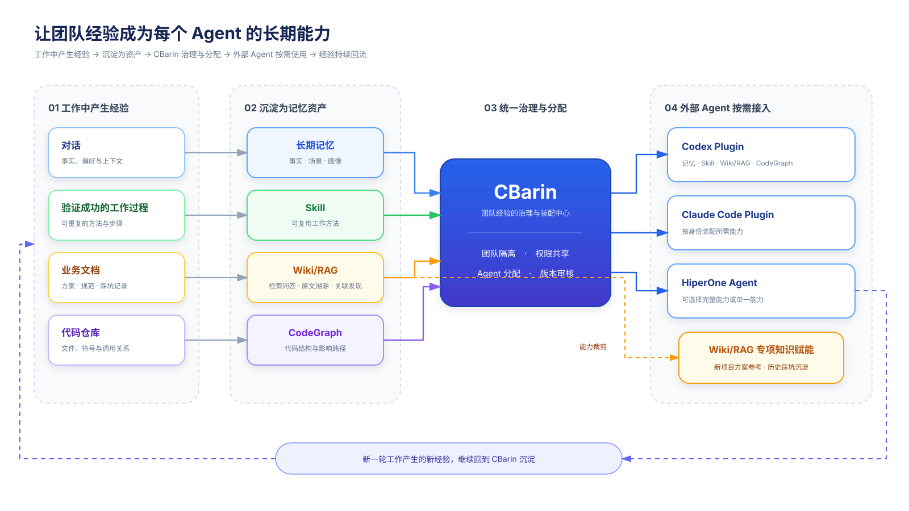

# CBarin 业务能力总览

CBarin 的核心不是向 Agent 暴露大量工具，而是建立一套让 Agent 持续继承团队经验的业务闭环：工作中产生的对话、成功方法、业务文档和代码知识被沉淀为资产，经过统一治理后，在后续工作中按需提供给合适的 Agent。

## 业务闭环

可编辑源文件：[CBarin 业务能力闭环.drawio](./assets/cbrain-business-loop.drawio)

## 四类核心能力

### 1. 记住交流过什么

对话逐步沉淀成事实、场景和长期认知，让 Agent 不必在每次新会话中重新了解用户、项目和团队背景。

### 2. 记住事情怎么做

从验证成功的工作过程中提炼 Skill，把一次成功经验变成可重复使用的工作方法。

### 3. 读懂业务文档

业务文档被整理成 Wiki/RAG。Agent 可以搜索知识、阅读加工后的知识页面、核对上传原文，并沿页面关系发现相关内容。

### 4. 读懂代码仓库

代码仓库被整理成 CodeGraph。Agent 可以理解文件和符号结构、查询调用关系，并分析代码修改可能影响的范围。

## CBarin 的作用

CBarin 负责统一管理四类资产，主要回答三个业务问题：

1. 这些经验属于哪个团队？
2. 哪些用户和 Agent 可以使用？
3. 每个 Agent 在工作时应该携带哪些资产？

它让团队能够共享经验，同时保留私有内容和精确授权。资产可以按团队共享，也可以只分配给指定用户或 Agent。

## Agent 如何使用资产

平台不会把所有资产一次性塞进 Agent 的上下文。Agent 先根据身份获得允许使用的资产，再根据当前问题按需搜索和读取相关内容。

因此：

- 长期记忆负责恢复用户、团队和工作场景；
- Skill 负责复用已经验证过的做法；
- Wiki/RAG 负责提供业务和文档知识；
- CodeGraph 负责提供代码结构与调用关系。

## 只接入 Wiki/RAG 的 Agent

如果一个 Agent 只需要文档知识，可以只接入 Wiki/RAG，不必同时使用长期记忆、Skill 或 CodeGraph。

这种接入方式只需要为 Agent 授予指定 Wiki/RAG 的只读权限。Wiki/RAG 的创建、文档上传、知识加工和权限管理仍由 CBarin 完成。完整图中的橙色虚线展示了这条能力裁剪路径。

## 最终形成的循环

Agent 使用已有记忆和知识完成新一轮工作；过程中产生的有效对话、成功方法、文档变化和代码变化，又可以继续沉淀和更新对应资产。

这套循环的目标是：让团队走过的路，成为下一个 Agent 的起点。

## 后续 TODO

### P0：形成可用的产品闭环

- [ ] 统一产品命名：将管理界面、安装说明和对外文档中的旧名称统一升级为 CBarin。
- [ ] 定义外部接入能力包：明确“完整能力”和“Wiki/RAG 专项能力”两种标准接入模式。
- [x] 完成 Claude Code Plugin：支持身份识别、资产装配、按需召回和异步经验沉淀。
- [ ] 完成 HiperOne Agent 接入：允许按身份选择完整能力或单一能力。
- [ ] 完成 Wiki/RAG 专项接入：只暴露搜索、知识页、原文溯源和关联发现能力。
- [ ] 补齐接入授权：每个外部 Agent 都必须绑定明确身份、团队范围和允许使用的资产。
- [ ] 完成真实端到端验收：覆盖首次接入、退出重进、权限变更、资产更新和服务降级。

### P1：提升知识可靠性与使用体验

- [ ] 增加知识资产对账：确保 Wiki/RAG 构建完成后一定能在 CBarin 中被发现和分配。
- [ ] 优化 Wiki/RAG 使用入口：围绕“新项目方案参考”和“历史踩坑沉淀”提供清晰场景指引。
- [ ] 增加来源说明：每条知识结果都能看到原始文档、更新时间和关联页面。
- [ ] 建立知识质量反馈：支持标记有用、过期、错误和需要补充的内容。
- [ ] 增加资产更新提醒：文档或代码变化后，提示相关知识资产重新加工或同步。

### P2：形成可持续运营能力

- [ ] 建立业务效果指标：观察知识命中率、经验复用率、重复踩坑减少情况和用户采纳情况。
- [ ] 建立资产运营视图：展示资产归属、使用范围、最近使用、版本和健康状态。
- [ ] 提供标准接入指南：分别给出 Codex Plugin、Claude Code Plugin 和 HiperOne Agent 的安装与使用说明。
- [ ] 沉淀示范案例：形成方案参考、故障复盘、研发规范和代码理解等典型用法。
