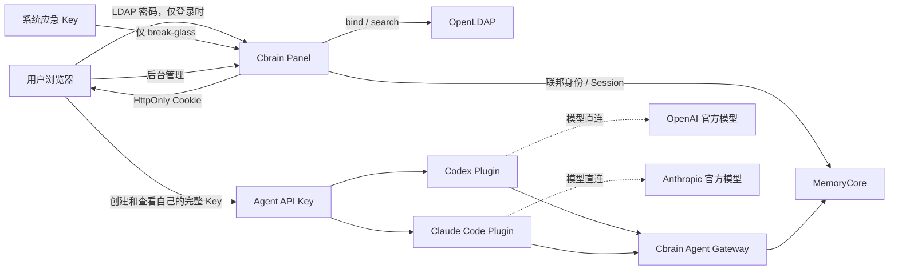

# Cbrain LDAP、Web Session 与 Agent API Key 架构

## 1. 决策摘要

Cbrain 使用 LDAP 作为后台主登录方式，使用系统级应急 Key 作为 break-glass 登录方式；两者成功后都只签发短期 HttpOnly Web Session。用户在后台创建的 Agent API Key 只供 Codex Plugin、Claude Code Plugin 等外部 Agent 使用，不能登录后台。

## 2. 边界与数据流

- Panel 负责 LDAP 协议、登录限流、Cookie 和浏览器会话入口。
- Core 负责外部身份唯一映射、Session 持久化、用户状态和 Team/Agent/资产授权。
- LDAP Group 不映射 Cbrain Team；LDAP 只证明“是谁”，Cbrain 决定“能做什么”。
- MemoryProxy 和模型调用链不参与 LDAP 登录；记忆侧故障不改变 Codex/Claude Code 的模型直连。
- 浏览器 localStorage 只保存实例选择，不保存密码、应急 Key、Agent API Key 或 Session。

## 3. 数据模型与接口

Core 新增 `meta_external_identities` 和 `meta_auth_sessions`。外部身份以 `(provider_id, subject_id)` 唯一；LDAP 使用 `entryUUID` 作为 subject。Session 数据库只保存 SHA-256 哈希，默认 12 小时绝对过期。

Panel 接口：

- `POST /api/v1/auth/ldap/login`
- `POST /api/v1/auth/recovery/login`
- `GET /api/v1/auth/session`
- `POST /api/v1/auth/logout`

Core 内部接口仅接受实例已有 Kernel Bearer：

- `POST /v3/internal/meta/federated/login`
- `POST /v3/internal/meta/federated/sync`
- `POST /v3/internal/meta/session/issue`
- `POST /v3/internal/meta/session/resolve`
- `POST /v3/internal/meta/session/revoke`
- `POST /v3/internal/meta/asset/ensure-owned`

Agent API Key 的所有人可在后台反复查看完整 `key_value`；管理员代查他人时只返回 `key_prefix`。用户允许撤销最后一把 Key。由于需要回显，当前沿用既有明文存储，接口响应禁止缓存且日志必须脱敏。

## 4. LDAP 同步和失败策略

- Panel 每 5 分钟取得一次最多 5000 人的完整分页快照。
- 只有完整查询成功才提交 Core；超时、断连、超限时不执行停用。
- 完整快照中的 LDAP 用户会预创建为 Cbrain 普通用户并建立外部身份映射，无需先登录；目录同步不创建 Agent API Key。
- LDAP 中消失的映射用户设为 inactive 并撤销 Web Session，其 Agent API Key 也因用户状态检查而失效；同一 LDAP subject 再次出现时恢复原 Cbrain 用户及其历史数据。
- LDAP 不可用时，已有 Session 继续到期，新登录返回 503。
- Code Graph 异步任务只保存 owner_user_id，回调不保存或重放用户凭证。

## 5. 安全和部署门槛

POC 可在显式 `CBRAIN_LDAP_ALLOW_INSECURE_POC=true` 下使用明文 LDAP，但只能使用一次性测试账号。正式环境必须启用 Cbrain HTTPS、LDAP StartTLS、CA 校验，并关闭匿名人员目录读取。`cbrain-bind` 必须是独立只读账号，不能复用其他系统服务账号。

部署采用候选容器和克隆元数据库验证后切换；LDAP 变更前分别备份 `cn=config` 和业务目录。数据库变更仅新增表/索引，旧镜像可回滚并忽略新增数据。

## 6. ADR

- ADR-001：LDAP 归 Panel，身份与会话归 Core，模型链路不接入 LDAP。
- ADR-002：LDAP Group 不自动映射 Team/Role。
- ADR-003：浏览器使用 HttpOnly 短期 Session，不持有用户 API Key。
- ADR-004：系统应急 Key 与 Agent API Key 是不可互换的两类凭证。
- ADR-005：Agent API Key 所有人可回显全文，跨用户管理视图继续脱敏。
