# TencentDB Agent Memory 平台架构设计（Codex / Claude Code 插件接入）

## 1. 执行摘要

本文设计对象不是单独的客户端插件或 Gateway，而是完整的 Agent Memory 平台。当前会话接入方式包括 Codex Plugin 与 Claude Code Plugin；平台服务端同时包含身份与组织、Team/Agent/Task、统一资产与权限、L0–L3 记忆、Skill、Wiki/Wiki Graph、CodeGraph、异步任务、管理面和运行时装配。

核心结论如下：

1. Codex 与 Claude Code 均保持原有官方模型调用链路；记忆能力作为旁路接入，不接管模型请求。
2. Team 是权限、资产和数据的隔离边界，不等同于本地目录或 Git 仓库。
3. Agent 是 Team 内长期稳定的记忆与资产装配主体；通常一个通用 Agent 足够，只有确实需要不同画像、提示词或资产集合时才拆分。
4. Workspace 是编码 Agent 本地工作目录的可移植身份。一个 Team 可绑定多个 Workspace；不同 Team 的项目必须分别绑定。
5. Task 是 Team 内可选的协作、归属和审计维度，不是新会话的必选项。
6. Chat Memory、Skill、Wiki 和 CodeGraph 都进入统一 Asset 注册表，再由可见性、ACL 与 Agent 固定资产绑定控制运行时可用范围。
7. Wiki Graph 是 Wiki ingest 的派生索引，不是另一套需要单独导入的数据；CodeGraph 是独立代码仓库索引资产。
8. 当前回合的召回同步且有短超时；回合存储、工具轨迹和 Skill 提取通过 Gateway 持久队列异步执行，不阻塞交互。

## 2. 目标与非目标

### 2.1 目标

- 完整说明从 Codex / Claude Code 会话到平台各层的真实调用链和数据流。
- 明确 Team、Agent、Task、Workspace、Session、Asset 的边界与关系。
- 说明 L0–L3 的生成、存储、召回、隔离和失败策略。
- 说明 Skill 的提取、版本化、资产登记、绑定和运行时使用。
- 说明 Wiki 原文、加工页面、Wiki Graph 的构建、搜索和读取机制。
- 说明 CodeGraph 的建图、同步、查询和影响分析机制。
- 给出接口、状态机、算法、权限、部署、测试、迁移和运维设计。

### 2.2 非目标

- 不改变 Codex 或 Claude Code 到各自官方模型服务的网络路径。
- 不把管理面 UI 当作运行时记忆注入器。
- 不要求每个目录、会话或任务都创建独立 Agent。
- 不把 Wiki Graph 和 CodeGraph 混成同一种图模型。
- 不承诺当前代码尚未测量的固定延迟、准确率或容量数字。
- 不在本文展开尚未实现的其他客户端接入方式。

## 3. 事实、推断与待确认项

### 3.1 已确认事实

- `MemoryCore` 同时承载 L0–L3、Skill、Metadata、权限和异步 Pipeline。
- `MemoryKnowledge` 承载 Wiki、Wiki Graph 和 CodeGraph 的元数据、构建与查询。
- `MemoryPanel` 是 Team、Agent、资产、Skill、Wiki、CodeGraph 和记忆的管理面。
- `MemoryAgentGateway` 使用服务端 SQLite 保存 Workspace 绑定、Session Context、待发送回合、工具轨迹和 Skill 提取事件；客户端不需要本地 SQLite。
- Codex Plugin 与 Claude Code Plugin 使用同一 Gateway 契约、Workspace 身份算法和异步 Relay 语义，仅 Hook 协议与安装载体不同。
- Agent 创建后会幂等创建私有 `chat_memory` Asset，并以 `summary` 模式固定绑定到该 Agent。
- Skill 创建后会登记同 ID 的 `skill` Asset，并以 `reference` 模式固定绑定到来源 Agent。
- Wiki 的原文件保存在 `raw/sources`，加工页保存在 `wiki/**`；索引库包含全文索引、页面元数据、图边和源状态。
- Wiki 检索以 BM25 为种子，可选沿 Wiki 页面关系做多跳扩展。
- CodeGraph 创建后异步克隆仓库并建立代码索引，提供 search、explore、callers、callees、impact、node、status 和 files 查询。
- Knowledge 的构建使用 `draft/pending/processing/ready/failed` 状态，并按单资产串行。

### 3.2 推断与适用条件

- 一个通用 Agent 可服务同一 Team 下多个项目目录，前提是这些目录应共享长期画像与固定资产。
- 若两个项目不应共享记忆、Wiki、Skill 或 CodeGraph，应放入不同 Team；只拆 Workspace 不能形成权限隔离。
- Task 当前更适合治理与审计，不应成为 Codex 首次绑定的强制选择。

### 3.3 待确认项

- 生产环境对 Wiki/CodeGraph 资产自动注册失败的补偿任务是否启用。
- 大规模部署时 Gateway SQLite 是否继续单实例写入，还是迁移到共享数据库。
- L1/L2/L3 的离线质量基准集、可接受误召回率和 Skill 采纳率阈值。
- `agent`、`task` 可见性的长期精确定义是否需要比当前实现更严格的主体约束。

## 4. 领域模型与边界

### 4.1 核心概念

| 概念 | 定义 | 生命周期 | 隔离/归属 |
|---|---|---|---|
| Principal | Gateway 识别的编码 Agent 使用主体 | 配置期 | 映射 Core User/User Key |
| User | 平台用户与权限主体 | 长期 | 可加入多个 Team |
| Team | 组织、权限、资产和数据隔离边界 | 长期 | 所有 Agent、Task、Asset 属于一个 Team |
| Agent | 长期记忆画像和固定资产装配主体 | 长期 | 必须属于一个 Team |
| Task | 可选工作单元、Agent 关联与审计范围 | 中期 | 必须属于一个 Team |
| Workspace | 本地项目目录的可移植身份 | 项目期 | 由 Principal 绑定到 Team + Agent |
| Session | 一次 Codex 或 Claude Code 会话 | 短期 | 继承 Workspace 的 Team + Agent |
| Context | Gateway 发放的临时不透明运行时凭据 | 短期 | 绑定 Principal + Team + User + Agent + Session |
| Asset | Chat Memory、Skill、Wiki、CodeGraph 的统一治理记录 | 长期 | Team 内受 visibility、ACL、binding 约束 |

### 4.2 聚合与关系

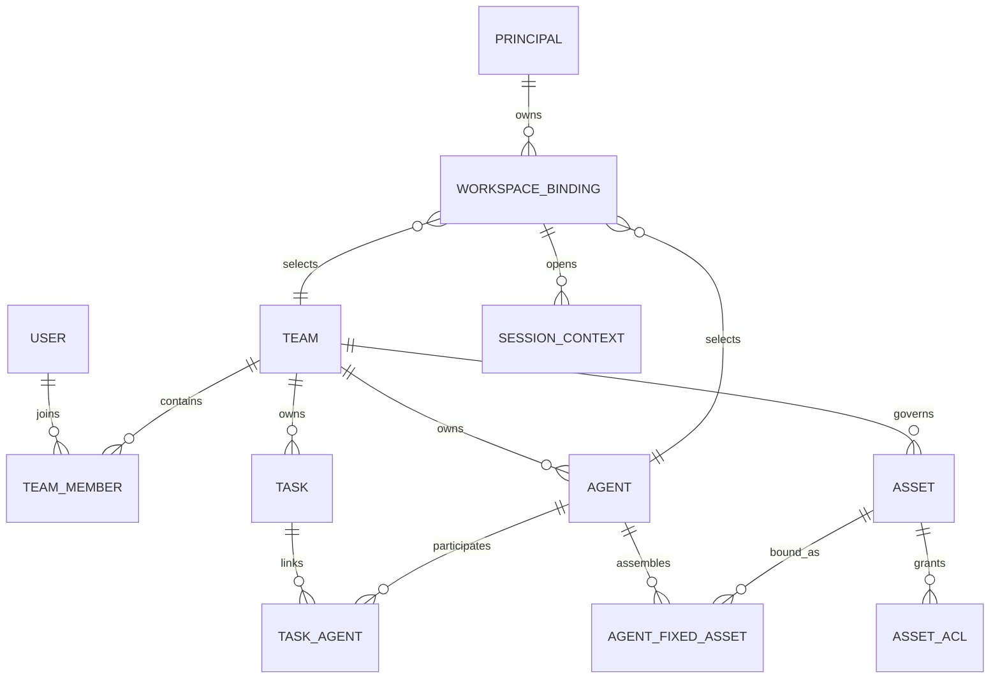

### 4.3 “项目”与 Git Remote

平台核心领域没有一个必须创建的 `Project` 实体。客户端插件把本地目录归一为 Workspace：

1. 优先使用标准化后的 Git remote + 仓库相对根形成可移植 key。
2. 无 Git remote 时退化为标准化路径/目录指纹。
3. Windows 与 WSL 的同一仓库应得到相同或可映射的 Workspace key。
4. Git remote 只帮助识别“这是同一个工作区”，不决定 Team，也不授予权限。

因此支持：多个目录共享一个 Team + Agent；同一目录重开会话自动复用绑定；不同 Team 的项目分别绑定。

## 5. 系统上下文与组件架构

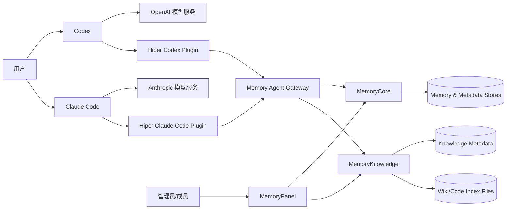

关键不变量：

- 模型链路 `Codex → OpenAI`、`Claude Code → Anthropic` 与记忆旁路分离。
- Gateway 不拥有 Team、Agent、Asset 的权威定义，只缓存/持久化绑定和会话事件。
- Core 是身份、组织、权限、记忆和 Skill 的事实源。
- Knowledge 是 Wiki/CodeGraph 内容与构建状态的事实源；Core Asset 只保存治理引用。
- Panel 是控制面，不应成为运行时请求的单点依赖。

### 5.1 组件职责

| 组件 | 主要职责 | 不负责 |
|---|---|---|
| Codex Plugin | Hook、Workspace 识别、绑定交互、MCP 工具、异步发送器 | 不保存权威 Team/Agent，不代理模型 |
| Claude Code Plugin | Claude Hook 适配、Workspace 识别、绑定交互、MCP 工具、异步发送器 | 不保存权威 Team/Agent，不代理模型 |
| Gateway | Principal 鉴权、绑定、Context、召回编排、资产授权交集、异步捕获 | 不生成 Wiki/CodeGraph，不定义资产权限 |
| MemoryCore | Metadata、ACL、L0–L3、Skill、Pipeline | 不保存 Wiki 正文和代码索引 |
| MemoryKnowledge | Wiki/Graph/CodeGraph 的构建、存储和查询 | 不决定用户是否可使用某资产 |
| MemoryPanel | 管理与治理操作 | 不参与每轮对话注入 |

### 5.2 部署与进程拓扑

当前推荐拓扑是服务端集中部署 Gateway、Core、Knowledge 和 Panel，客户端机器只安装对应插件：

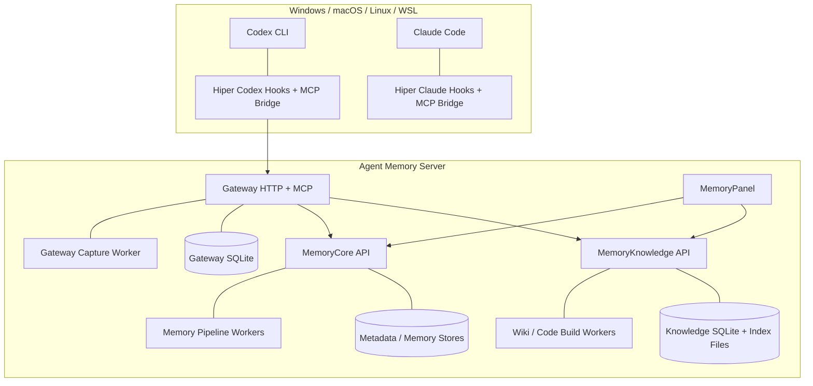

插件脚本必须使用 Node 与路径归一化能力兼容四类客户端环境。Gateway SQLite、Core 状态后端和 Knowledge 索引都属于服务端数据；不能把服务端数据库复制到客户端，也不能依赖某个用户工作目录作为权威存储。

## 6. Team、Agent、Task 与资产机制

### 6.1 Team

Team 是强制隔离边界。创建 Team 时 owner 固定成为 active admin；成员角色为 `admin/member/reviewer`。Team 下创建 Agent、Task、Asset 时都校验 Team 存在，跨 Team 的 Agent/Task 关联被拒绝。

建议规则：

- 需要共享记忆和资产的多个目录放在同一 Team。
- 不应互见的客户、业务或安全域拆成不同 Team。
- Team 名称表达组织/隔离域，不必一一对应仓库名。

### 6.2 Agent

Agent 不是模型实例，也不是每个 Codex 窗口临时创建的 Session。它是长期运行身份，持有：

- `name/description/prompt/visibility/status`；
- Agent 级 L2/L3 画像；
- 私有 Chat Memory Asset；
- 固定 Skill/Wiki/CodeGraph 资产集合；
- 可选 Task 参与关系。

一个 Agent 足够的条件：同一 Team 下各项目希望共享长期偏好、工作方式和资产。需要拆 Agent 的条件：画像、提示词、资产集合或职责必须隔离。

#### 6.2.1 领域 Agent 与内部处理 Agent

仓库中没有另一个需要用户创建和绑定的独立 `CoreAgent` 领域实体。界面中的 Agent 就是 Metadata `meta_agents` 记录。代码里出现的 Review Agent、L1/L2/L3 executor 等属于服务内部的 LLM 处理角色：

- Memory Pipeline executor 从 L0 提炼 L1、聚合 L2/L3；
- Skill Review Agent 阅读已结束的对话和现有 Skill，并通过受控工具创建或更新 Skill；
- Wiki ingest 的 LLM executor 把原始文档加工为结构化页面。

这些内部处理角色不参与 Workspace 绑定，不拥有独立 Team/ACL，也不应出现在 Codex 的 Team/Agent 选择列表中。它们产生的数据仍归当前 Team、Agent 或 Knowledge Asset。

### 6.3 Task

Task 支持 running/completed、关联 Agent、角色、参与日志和可选 `task_id` 数据维度。当前 Codex 绑定只选择 Team + Agent，Task 不强制出现。后续若用户明确关联任务，可把 `task_id` 写入 L0/L1 与审计，但不能跨 Team 绑定 Agent。

### 6.4 统一 Asset

Asset 类型为：

- `chat_memory`
- `skill`
- `llm_wiki`
- `code_graph`

Asset 保存 ID、Team、owner、来源、版本、visibility、status、confidence、content reference、使用计数等治理元数据。真正内容分别由 MemoryCore 或 MemoryKnowledge 持有。

### 6.5 可见性、角色与 ACL

当前权限判定顺序：

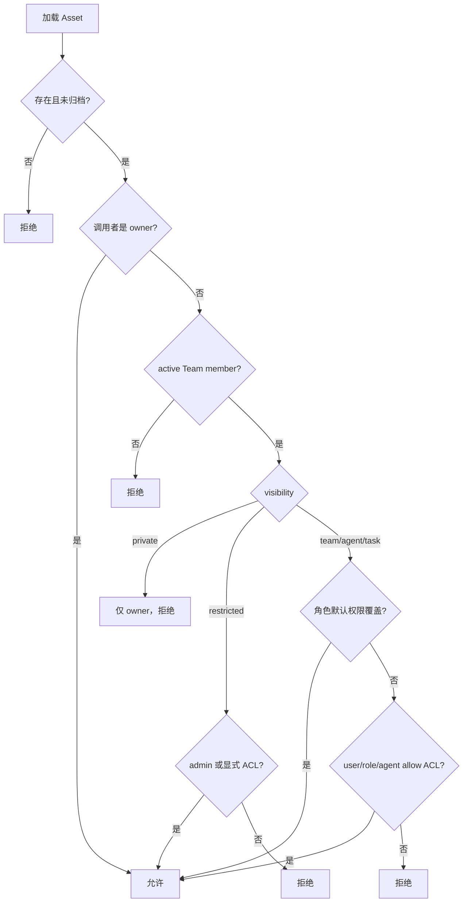

角色默认权限：admin 为 `read/write/assign/share`，普通成员默认 `read`。ACL 主体支持 user、team_role、agent，当前执行模型以 allow 为主。

固定绑定还要通过 `canBindAsset`：

- `team/agent`：Asset 和 Agent 必须同 Team；
- `private`：还要求 Asset owner 与 Agent owner 相同；
- `task/restricted`：当前不可直接固定绑定。

运行时可用资源必须同时满足：Core 返回的固定绑定、当前用户权限、Knowledge 中资源 ready 且 ID/type 匹配。Gateway 不能仅凭客户端传入的 Wiki/CodeGraph ID调用。

## 7. Workspace 绑定与 Session Context

### 7.1 首次绑定

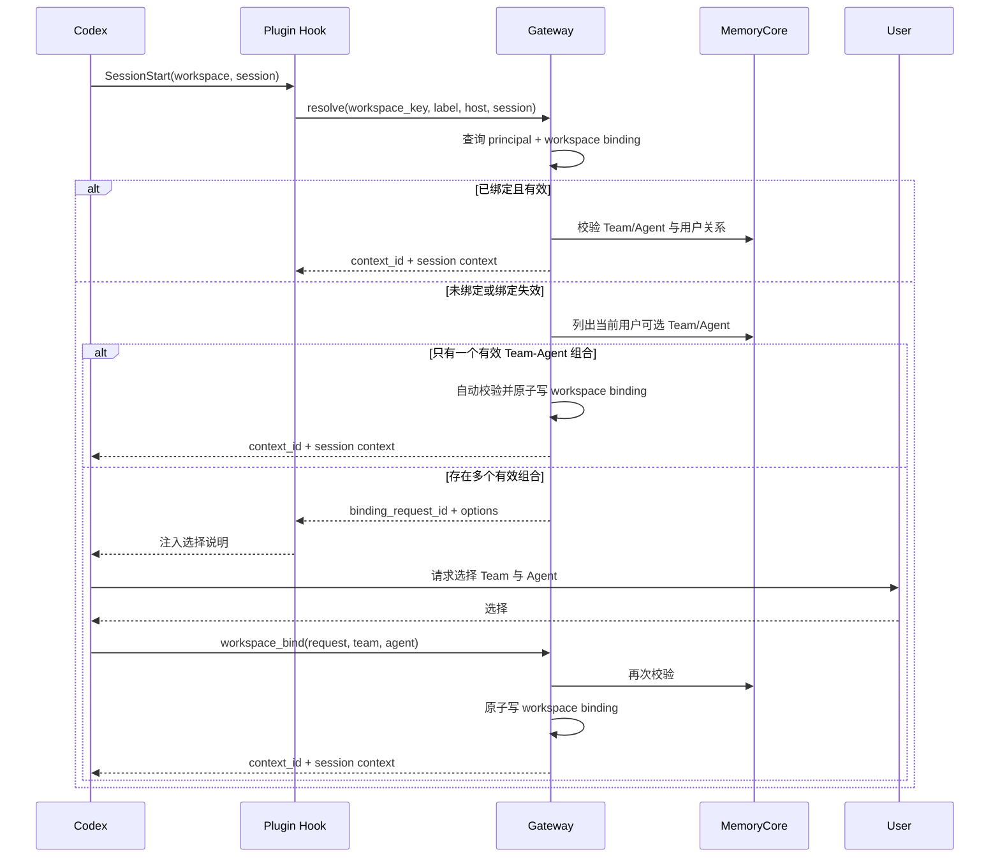

绑定请求是一次性且有过期时间，避免客户端伪造 workspace/team/agent 组合。绑定以 `(principal_id, workspace_key)` 为主键集中保存，因此退出重进仍可复用。

### 7.2 改绑与解绑

- 用户明确要求查看：调用 `workspace_status`。
- 用户明确要求改绑：调用 `workspace_rebind`，生成新的一次性选择请求；原绑定在成功前保留。
- 用户明确要求解绑：调用 `workspace_unbind`；下次 Prompt 再进入选择。
- 临时上游故障不删除有效绑定；只有确认 Team/Agent 已失效才移除陈旧绑定。

### 7.3 Context 安全

`context_id` 是短期不透明 ID，服务端关联 Principal、User、Team、Agent、Session、Workspace 和过期时间。完整编码 Agent Profile 中的 Memory/Skill/Wiki/CodeGraph MCP 工具都必须携带它。Gateway 再校验 Context 属于当前 Principal，避免客户端自行传 Team/Agent 绕过绑定。独立 Wiki/RAG Profile 不进入会话记忆，因此只用 API Key 自动解析 Wiki 范围，不接受 `context_id/team_id/agent_id`。

## 8. L0–L3 记忆机制

### 8.1 分层语义

| 层级 | 内容 | 作用域 | 主要用途 |
|---|---|---|---|
| L0 Conversation | 原始用户/助手回合和完整来源 | Team + User + Agent + Session，可选 Task | 审计与原话核对 |
| L1 Atom | 事实、偏好、约束、事件等原子记忆 | Team + User + Agent，召回可跨 Session | 精确检索 |
| L2 Scenario | 围绕场景组织的记忆块 | Team + Agent | 快速恢复工作场景 |
| L3 Core/Persona | 长期画像、稳定模式和高层认知 | Team + Agent | 建立长期语境 |

L0 是不可变流水；L1 支持版本更新/合并；L2/L3 是聚合画像。强隔离数据面要求 Team + User + Agent 三元组，L0/L1 可带 Session，L2/L3 忽略 Session。

### 8.2 沉淀 Pipeline

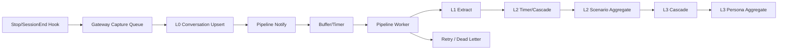

写入 L0 后，Pipeline 通知失败不回滚已保存的 L0。Worker 使用任务队列、按 Session/Instance 锁、锁续约、幂等 upsert、指数退避和死信。L1 完成推进 L2，L2 完成可推进 L3；Timer 提供延迟聚合和兜底。

### 8.3 召回

每次 `UserPromptSubmit`：

1. Gateway 校验 Context。
2. 并行读取 L1 搜索、L2 场景导航和 L3 画像。
3. L1 搜索使用关键词、向量或混合策略；无 embedding 时 BM25 仍可用。
4. 结果按超时、最低分、条数与字符预算裁剪。
5. 原始 L0 不自动注入，只在用户明确核对原文/时间/来源时通过工具查询。
6. 召回内容标记为不可信上下文，当前用户指令优先。

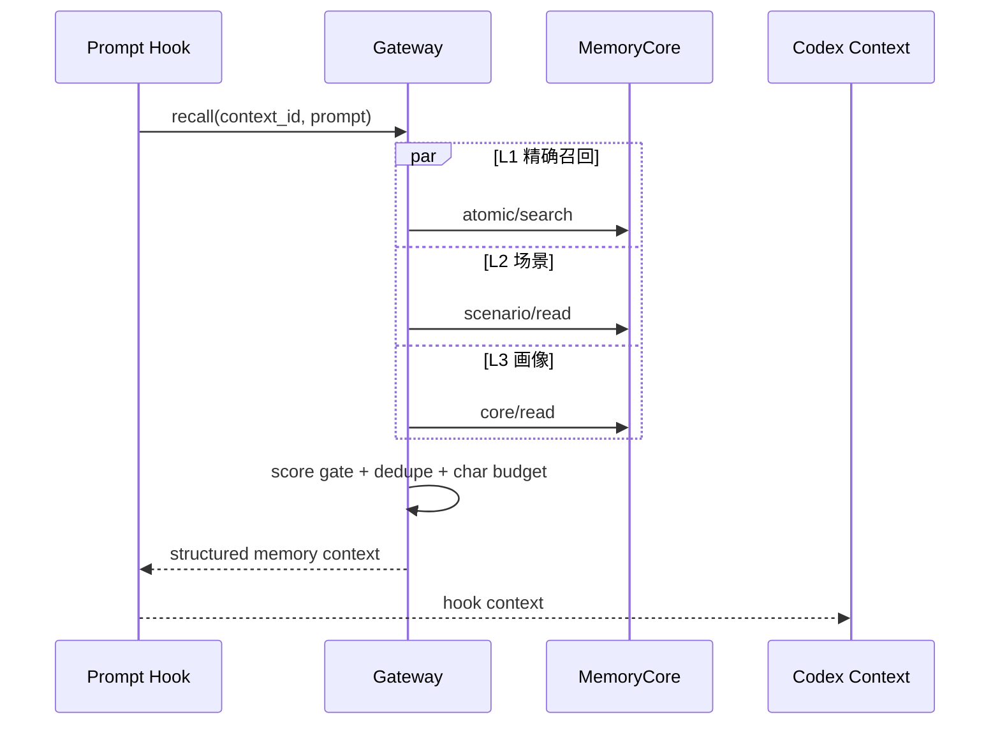

### 8.4 一致性与用户体验

- Recall 同步，因为结果服务当前回合，但受短超时保护，失败时返回空上下文继续对话。
- Capture 异步，Hook 启动独立发送器后立即返回；进程退出前事件已写入 Gateway SQLite。
- 异步存储允许最终失败，失败进入重试/死信，不影响已完成的用户交互。
- 新写入的 L0/L1 不保证同一瞬间可被下一请求看到，属于最终一致。

## 9. Skill 完整机制

### 9.1 Skill 是什么

Skill 是可复用工作流资产，不是每轮对话摘要。它应包含可复用的操作方法、约束、模板或资源文件，并具有独立版本。普通偏好和单次事实应进入 Memory，不应生成 Skill。

### 9.2 生成路径

平台有两种真实触发：

1. Core 的对话累积路径：buffer 达到默认 10 次 `tool_call` 或 40 KiB 后归档并异步评审。
2. Codex SessionEnd 直接提取路径：Gateway 先判断会话是否包含足够的可复用工作流和工具证据；简单聊天直接跳过，符合条件才调用 Skill extract。

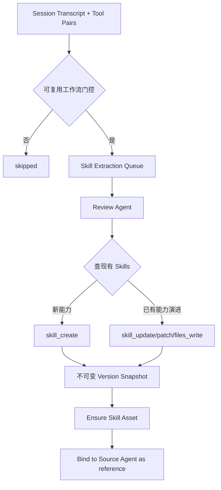

工具调用与结果按 `tool_call_id` 成对保存；超长负载压缩且保持合法 JSON；提取任务按 Agent 串行并有锁、重试、永久/瞬时错误分类和 DLQ。

### 9.3 版本与资产

- Skill 主表每行是 `(skill_id, version)` 的不可变快照，head 指向当前版本。
- 更新基于 expected version 和内容 hash，内容未变化时幂等返回。
- 资源目录按版本复制/写入，旧版本按 TTL 和保留策略清理。
- `skill_id` 同时作为 Asset ID；默认私有，并绑定来源 Agent，注入模式为 `reference`。
- Team 共享或特定用户/Agent 使用必须显式调整 visibility/ACL。

### 9.4 运行时使用

SessionStart 只加载压缩后的 Skill listing，不把所有 Skill 正文塞进上下文。Codex 根据当前任务选择 Skill 后，再调用 `skill_get` 或 `skill_file_read` 读取内容。这样控制上下文开销，也避免无关 Skill 自动执行。公开 MCP 用可选 query 的 `skill_search` 同时承担列举和检索，内部 listing 仅供 SessionStart 编排。

## 10. Wiki 与 Wiki Graph 完整机制

### 10.1 数据模型

一个 Wiki 资产包含三层内容：

| 层 | 物理/逻辑内容 | 用途 |
|---|---|---|
| Raw | `raw/sources/*` 原始上传文档 | 原文读取、重新 ingest、来源审计 |
| Pages | `wiki/entities|concepts|sources|comparisons|synthesis/*.md` | LLM 加工后的知识页 |
| Index | `wiki_fts`、`page_meta`、`graph_edge`、`source` | 搜索、关系图和增量状态 |

Wiki Graph 的节点是加工页面，边来自页面正文中的 `[[wikilink]]`。隐藏类型可进入全文检索，但不进入可视图边关系。Graph 不是单独上传、也不是单独分配的 Asset。

### 10.2 创建与 ingest

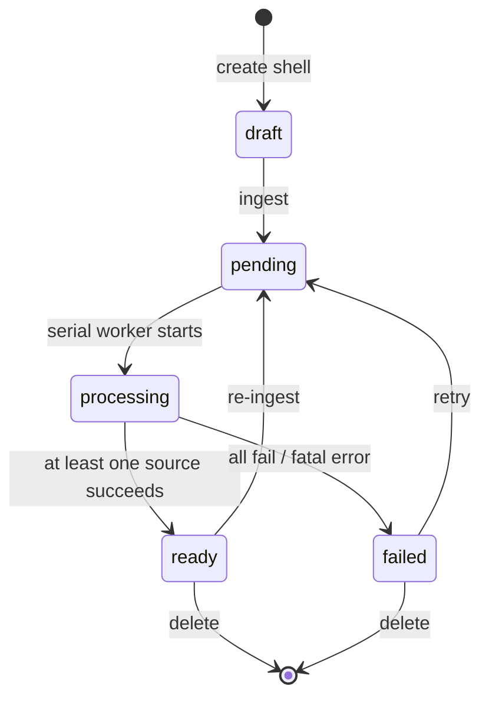

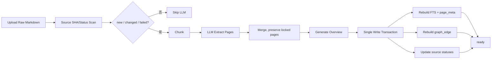

增量 ingest 以源文件 SHA 和上次状态决定是否调用 LLM。页面、图边和 source 状态在同一索引写事务内重建；手工写入页面会注入 `locked: true`，避免后续自动加工覆盖。删除 raw/page 时执行级联清理。

### 10.3 Wiki 搜索算法

问题：既要命中明确关键词，也要发现页面链接关系中的相关知识。

算法：

1. SQLite FTS/BM25 检索种子页面。
2. `hop=0` 时直接按 BM25 返回。
3. `hop>0` 时在 Wiki Graph 上按层 BFS。
4. 邻居分数 `score(h) = seed_score × decay^h`。
5. 低于 `minScore` 的节点丢弃；多路径命中保留最高分；种子始终冻结为 hop 0。
6. 最多访问 200 个节点，最终按分数降序并截断 limit。

复杂度：FTS 由 SQLite 索引承担；图扩展典型为 `O(V_visited + E_visited)`，且由访问节点上限控制。结果包含 path、title、snippet、score、type、hop、via、related 和结果间 links，便于解释来源。

失败降级：Wiki 未 ready 或索引不可用返回空；图加载失败可退化为纯 BM25；某些源失败但至少一个源成功时 Wiki 可 ready，同时保留失败源状态供修复。

### 10.4 原文与加工页读取

- `wiki_search/wiki_list/wiki_read` 查询和读取加工页面；搜索结果返回不透明 `page_ref`。
- `wiki_source_read` 通过页面返回的 `source_ref` 读取上传原文，调用方不直接拼文件路径。
- `wiki_related` 在内部图数据上做 1–2 跳有界遍历，不向模型暴露整张图。
- 完整 Agent Profile 的路径必须通过 Context 和固定资产权限交集；独立 Wiki/RAG Profile 则通过 API Key 解析用户拥有的所有 active Agent，再对每个 Agent 做固定绑定与可读资产交集。两条路径都在每次读取前重新授权并拒绝目录穿越。

## 11. CodeGraph 完整机制

### 11.1 创建与同步

CodeGraph 以 `repo_url + branch` 注册。创建即进入 pending，后台流程为：

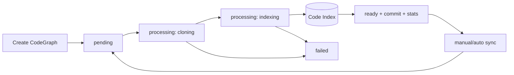

每个资产 ID 有独立串行队列，同一仓库索引不会并发重建；不同资产可并行。物理目录按 `service_id/team_id/code_graph_id` 隔离。首次构建全量索引，后续同步拉取代码并重建/同步索引。

### 11.2 查询能力

- `code_search`：按关键词搜索符号/文件。
- `code_explore`：探索与查询相关的源文件。
- `code_relationships`：按 `callers/callees/both` 查询调用关系。
- `code_impact`：变更符号的影响分析。
- `code_node`：符号详情，可选源码。
- `code_files`：文件树/列表。

Gateway 将工具名映射到 Knowledge ToolHandler，但必须先验证该 CodeGraph 是当前 Agent 可用的固定资产，不能把任意仓库 ID 当作授权。

### 11.3 删除、取消与恢复

- pending/processing 时删除会设置内存取消标记，并立即幂等清理元数据、实例句柄和磁盘目录。
- Worker 在开始与完成前检查资产是否已删除，避免删除后又写回 ready。
- 服务重启时未完成的 pending/processing 记录标记 failed，ready 资产恢复索引句柄。
- 构建完成写 commit、files/nodes/edges stats、summary 和审计；回调失败不回滚已完成索引。

## 12. Knowledge Asset 注册与 Agent 装配

Wiki/CodeGraph 的内容状态由 MemoryKnowledge 持有，统一治理记录由 MemoryCore 持有。控制面流程如下：

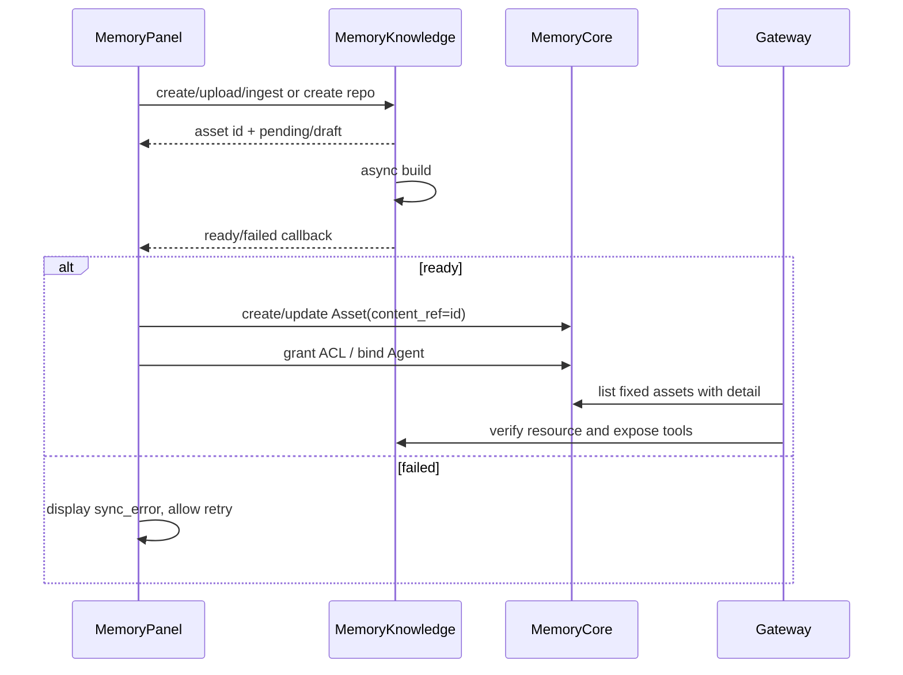

现状风险：Panel 使用内存态任务注册表暂存 owner key，进程重启可能丢失“Knowledge ready 后登记 Core Asset”的补偿上下文。目标设计应新增持久化 outbox/reconciliation：定期对比 Knowledge ready 资源与 Core Asset，按 owner/team 幂等补登记；不能只依赖一次回调。

## 13. 客户端插件与 Gateway 运行机制

### 13.1 Hook

| Hook | 行为 | 同步性 |
|---|---|---|
| SessionStart | 识别 Workspace、解析绑定、创建 Context、加载 Agent/Skill/资产摘要 | 同步，有降级 |
| UserPromptSubmit | 开始 turn、召回 L1/L2/L3 | 同步，短超时 |
| PostToolUse | 记录成对工具轨迹 | 本机 UDP 投递，Bridge 批量异步发送 |
| Stop | 保存用户/助手回合 | 本机 UDP 投递，Bridge 批量异步发送 |
| SessionEnd | 发起会话级 Skill 门控与提取 | 本机 UDP 投递，Bridge 批量异步发送 |

### 13.2 MCP 工具分组

- 完整 `/mcp` Profile 共 24 个工具：Workspace 4、Memory 5、Skill 3、资源发现 1、Wiki/RAG 5、CodeGraph 6。
- Workspace：bind/status/rebind/unbind。
- Memory：status/profile/search/conversation-search/scene-read；profile 合并 Agent prompt、L3 与分页 L2 索引。
- Skill：search/get/file-read；search 的 query 可选，省略即列举。
- Wiki/RAG：search/list/read/source-read/related；默认跨当前 Agent 绑定的全部 Wiki 搜索。
- CodeGraph：search/explore/relationships/impact/node/files。

除未绑定阶段的 Workspace 工具外，领域工具都要求 `context_id`。

独立 `/mcp/wiki` Profile 面向只需要参考既有方案、业务文档和踩坑沉淀的外部 Agent，共 6 个工具：resources/search/list/read/source-read/related。客户端只传页面 API Key；Gateway 自动按“用户 → 跨 Team 的 active 自有 Agent → 固定 Wiki → 可读 Asset → ready Knowledge”解析并去重范围。多 Wiki 搜索在每个 Wiki 内沿用 BM25，跨 Wiki 用 RRF 合并；单 Wiki 失败返回 warning，全部失败才返回 MCP error。

### 13.3 异步捕获

Hook 只向当前客户端环境按 Gateway 配置共享的本机 Event Relay 发送 loopback UDP 数据报；MCP Bridge 负责确保 Relay 存在，但 Relay 使用独立空闲生命周期，避免 MCP 先退出导致 Stop/SessionEnd 丢失。Relay 使用有界内存队列进行 100ms 聚合并调用批量接口，不在客户端创建 SQLite 或逐事件后台进程。事件允许丢失，队列满时优先保留 Stop 和 SessionEnd。Gateway 收到批量 Hook 事件后逐项校验并写本地持久队列，立即响应。后台 Worker 独立把同一回合发送到：

- Core L0/记忆 Pipeline；
- Skill conversation 或 direct extract。

两个 sink 独立记录状态与重试，不因一个失败重复另一个。达到重试上限进入 dead letter。Gateway 清理过期 Context 时会保留仍有关联待处理事件的 Context。

### 13.4 Codex 与 Claude Code 适配边界

- 两个插件共享 Gateway API、MCP 工具、Hiper 配置目录、Workspace 指纹算法与 Relay 数据报协议。
- Codex 使用 Codex Plugin Hook 协议；Claude Code 使用 `${CLAUDE_PLUGIN_ROOT}`、Claude Hook JSON 输出和 Claude Marketplace。
- Claude Code 不提供稳定的 turn id 时，插件为每个用户提示生成客户端 turn id，并在后续 Tool/Stop Hook 中复用。
- 两端运行时发布为各自插件内的完整副本，因为 Marketplace 安装只缓存当前插件目录；仓库测试要求公共运行时逐字节一致，防止实现漂移。

## 14. API 与数据契约

### 14.1 外部边界

| 边界 | 关键接口 | 契约重点 |
|---|---|---|
| Plugin → Gateway | workspace resolve/bind/status/rebind/unbind | Bearer Principal、一次性 binding request |
| Plugin → Gateway | session/prompt/hook batch | context_id、turn_id、批量上限、逐事件幂等 |
| Client MCP → Gateway | Memory/Skill/Wiki/Code tools | context_id + 资源 ID，服务端二次授权 |
| Wiki-only MCP → Gateway | `/mcp/wiki` 只读检索 | Bearer API Key，自动 Agent/Wiki 范围，无 context_id |
| Gateway → Core | Metadata、L0–L3、Skill | service token + user key + isolation fields |
| Gateway → Knowledge | Wiki/Code read tools | 仅使用已授权固定资产 ID |
| Panel → Core | Team/Agent/Task/Asset/ACL | 用户身份和角色权限 |
| Panel → Knowledge | create/ingest/sync/delete/query | Team、owner、状态与版本 |

### 14.2 幂等键与状态所有权

| 对象 | 幂等/唯一键 | 状态所有者 |
|---|---|---|
| Workspace Binding | principal_id + workspace_key | Gateway |
| Session Context | context_id；复用查询含 principal/host/session/workspace/team/agent | Gateway |
| Capture Event | 规范化回合 hash/event_id | Gateway |
| L0 | record_id | MemoryCore |
| Chat Memory Asset | `chat_memory-{team}-{agent}` | MemoryCore Metadata |
| Skill Version | skill_id + version | MemoryCore Skill |
| Agent Binding | agent_id + asset_id | MemoryCore Metadata |
| Wiki | service_id + team_id + wiki_id | MemoryKnowledge |
| CodeGraph | service_id + team_id + code_graph_id | MemoryKnowledge |

## 15. 安全、性能、可用性与可观测性

### 15.1 安全

- 不把真实 token 写入插件仓库、日志、Skill 或 Wiki。
- Gateway Principal token 只识别接入主体；Core user key 决定真实用户权限。
- Context 必须同时校验 Principal，不能跨用户复用。
- 所有 Knowledge 工具执行前做固定绑定与权限交集验证。
- Memory、Wiki、Skill 内容均按不可信数据处理，不得覆盖系统/用户指令。
- Wiki/Code 文件读取采用根目录约束和路径标准化。

### 15.2 性能

- SessionStart 中固定资产、Skill listing、Knowledge 资源并行读取并缓存。
- Prompt Recall 并行查询 L1/L2/L3，设置全局短超时、最低分和字符预算。
- L0 写入、Skill 提取、Wiki ingest、CodeGraph build 全部移出交互关键路径。
- Wiki FTS 和图索引在 SQLite 中持久化，图查询时按 Wiki 加载小型读模型并限制扩展节点。
- 同一 Knowledge 资产串行构建，防止文件和 SQLite 冲突。

### 15.3 可用性与恢复

| 故障 | 当前行为 | 目标/运维动作 |
|---|---|---|
| Gateway 不可用 | Hook 降级，Codex 继续 | 告警并恢复服务，不影响模型直连 |
| Recall 超时 | 空上下文继续 | 记录分层耗时与超时率 |
| Capture 失败 | 重试后 DLQ | 提供 DLQ 查询/重放 |
| Core Pipeline 失败 | 重试/DLQ，L0 已保存 | 监控层级积压 |
| Wiki 部分源失败 | 至少一个成功可 ready | UI 展示失败源并允许重试 |
| Knowledge 构建中重启 | 未完成状态转 failed | 明确重试入口 |
| ready 回调丢失 | 可能未注册 Asset | 持久 outbox + reconciliation |
| Gateway SQLite 损坏 | 绑定/待处理事件受影响 | 定期备份、完整性检查、恢复演练 |

### 15.4 可观测性

至少按 `principal_id/team_id/agent_id/context_id/session_id/turn_id/task_id/asset_id` 关联日志，但不得记录 token 和完整敏感正文。核心指标：

- Workspace 绑定成功/失效/改绑次数；
- Recall 各层 p50/p95、超时率、注入字符数、L1 低分过滤率；
- Capture 队列深度、重试、DLQ；
- L1/L2/L3 任务积压、耗时、失败；
- Skill 门控通过率、候选数、创建/更新比、失败分类；
- Wiki ingest 源数、跳过数、失败数、页数、图节点/边数；
- CodeGraph clone/index 耗时、files/nodes/edges、同步失败；
- Knowledge ready 但未注册 Asset 的漂移数量。

## 16. 测试与验收策略

### 16.1 测试矩阵

| 层级 | 正常路径 | 边界/失败 | 验收重点 |
|---|---|---|---|
| Team/Agent | 创建 Team、成员、Agent | 跨 Team Agent、inactive Agent | 隔离不变量 |
| 权限 | owner/admin/member/ACL | private、restricted、跨 Team | 不越权 |
| Workspace | 单一组合自动绑定、多组合首次选择、重启复用、多目录同 Team | 请求过期、失效绑定、改绑/解绑 | 单一有效组合自动绑定，多组合不静默默认 |
| Memory | L0 写入、L1→L2→L3、跨 Session L1 召回 | Pipeline notify 失败、锁丢失、DLQ | L0 不丢、异步不阻塞 |
| Skill | 工具型会话 create/update | 简单聊天跳过、超长工具、并发 Agent | 不滥生成、版本幂等 |
| Wiki | 上传、增量 ingest、原文/页/图读取 | 全源失败、部分失败、locked page、路径穿越 | 状态和来源正确 |
| Wiki Search | BM25、hop 0/1/2、多路径 | dense graph cap、空索引 | 分数、hop、上限稳定 |
| CodeGraph | clone/index/search/impact/sync | invalid repo、删除中构建、重启 | 状态机与清理幂等 |
| E2E | Codex 新会话→绑定→召回→异步存储→重开 | Gateway/Core/Knowledge 单点降级 | 模型链路不受影响 |

### 16.2 算法评测

- Memory Recall：构造事实、偏好、否定约束、过期信息、跨 Session 样本，测 Precision@K、Recall@K、误注入率和字符预算命中率。
- Wiki Search：构造关键词命中、仅图关联、多路径、环和高密度图，验证 BM25 种子冻结、衰减公式、最高分路径和 200 节点上限。
- Skill Gate：正样本为可复用多步工具流程，负样本为寒暄、一次性查询和无工具对话，测不必要 LLM 调用率与有效 Skill 采纳率。
- CodeGraph：在固定 commit 上验证 symbols、callers/callees、impact 和 stats 可复现；版本变化后记录 commit 以支持归因。

没有实测基准前，不写死效果或延迟承诺。上线门槛应由真实测试集和生产观测确定。

## 17. 迁移与实施方案

### Phase 1：统一事实与文档

- 以本文领域模型统一 Team、Agent、Workspace、Task 和 Asset 术语。
- Codex 插件文档明确首次绑定、改绑、解绑、Windows/WSL 可移植身份和异步语义。
- 只有一个有效 Team-Agent 组合时允许自动绑定；多个组合必须显式选择，不能用默认值掩盖隔离边界。

### Phase 2：完整运行时装配

- SessionStart 返回 Agent profile、压缩 Skill listing 和可用 Knowledge 资源摘要。
- MCP 工具统一执行 Context + fixed binding + permission 三重验证。
- Recall 保持只自动注入 L1/L2/L3，L0/Wiki/CodeGraph 按需工具读取。

### Phase 3：Knowledge 注册可靠性

- 将 Panel 内存 Knowledge task registry 替换/补充为持久 outbox。
- 增加 `ready Knowledge ↔ Core Asset` 定期 reconciliation。
- 保留 callback 作为低延迟通知，reconciliation 作为最终一致兜底。

### Phase 4：规模化

- 对 Gateway SQLite 做备份、WAL/锁争用和容量压测。
- 达到多副本需求时，把 Gateway Store 接口迁移到共享持久层，保持 API 和领域模型不变。
- 对 Wiki 大图、CodeGraph 大仓库和 Core Pipeline 做容量基准与资源配额。

## 18. 架构决策记录

### ADR-001：模型链路与记忆旁路分离

- 决策：Codex 继续直连模型；插件只通过 Hook/MCP 连接记忆平台。
- 原因：降低延迟、故障域和供应商耦合。
- 后果：Hook 失效时记忆降级，但对话仍可继续。

### ADR-002：Team 是隔离边界，Workspace 不是

- 决策：权限和资产按 Team 隔离，Workspace 仅决定默认 Team + Agent 绑定。
- 原因：支持多个目录共享团队，同时避免把本地路径当安全边界。
- 后果：跨 Team 项目必须显式分别绑定。

### ADR-003：Agent 是长期装配主体

- 决策：L2/L3、Chat Memory 和固定资产都挂到 Agent，不按 Session 创建 Agent。
- 原因：保证跨会话连续性，减少管理成本。
- 后果：不同画像/资产边界必须拆 Agent。

### ADR-004：统一 Asset 治理，内容分域存储

- 决策：四类资产统一登记权限元数据，正文/索引仍由对应服务持有。
- 原因：统一授权与装配，避免把大内容复制进 Metadata。
- 后果：需要可靠的跨服务注册与对账。

### ADR-005：同步读、异步尽力写

- 决策：当前回合召回同步且短超时；Capture、Pipeline、Skill、Knowledge 构建异步。
- 原因：上下文读取必须先于模型响应，沉淀不应阻塞交互。
- 后果：写入是最终一致，必须有队列、幂等、重试和 DLQ。

### ADR-006：Wiki Graph 是 Wiki 派生读模型

- 决策：图边由加工页 wikilink 生成，与 FTS/Page Meta 同事务重建。
- 原因：避免原文、页面和图谱状态分裂。
- 后果：修改页面关系需要重建索引；Graph 不独立授权。

### ADR-007：Knowledge Build 按资产串行

- 决策：同一 Wiki/CodeGraph 的 build/sync 串行，不同资产可并行。
- 原因：避免同目录和 SQLite 索引并发冲突。
- 后果：单个超大资产的后续任务会排队，需要状态和取消能力。

### ADR-008：Task 保持可选

- 决策：Codex 首次绑定只选 Team + Agent，Task 通过显式工作流关联。
- 原因：多数个人开发会话不需要 Task；强制选择会增加摩擦。
- 后果：需要任务级审计时必须由用户或上层流程显式提供 task_id。

## 19. 三轮架构评审

### 19.1 第一轮：边界评审

结论：通过，附两项约束。

- Team/Agent 的权威状态必须只来自 Core；Gateway 的 binding 不是权限授予。
- Knowledge 内容和 Core Asset 是跨服务引用，必须通过对账解决回调丢失。

已排除：把 Git remote 当 Team、每会话创建 Agent、把 Graph 当独立上传资产、让 Panel 进入每轮运行时链路。

### 19.2 第二轮：设计评审

结论：有条件通过。

- Memory、Skill、Wiki、CodeGraph 的状态机和幂等键已明确。
- 权限采用 fixed binding 与实时 permission 的交集，符合最小授权。
- Wiki BM25 + BFS 算法有访问上限、分数解释和纯 BM25 降级。
- Gateway SQLite 适合当前单实例规模；多副本前必须抽象共享 Store。
- Panel Knowledge task registry 的内存态是当前最大一致性缺口，必须列入 Phase 3。

### 19.3 第三轮：质量评审

结论：文档覆盖完整平台主链路，可进入实现/验收基线。

- 可测试性：各状态机、权限分支、算法不变量和 E2E 路径均有对应测试矩阵。
- 可观测性：跨组件关联字段与核心指标已定义。
- 安全性：模型链路分离、Context 约束、权限交集、路径约束和不可信上下文已覆盖。
- 可演进性：Gateway Store、Knowledge Store 和内容服务保持边界，允许后续扩容而不改变 Codex 契约。

## 20. 风险与最终建议

### 20.1 主要风险

1. Knowledge ready 回调与 Core Asset 注册之间缺少持久补偿，可能出现页面可见但 Agent 工具不可用。
2. 当前 `agent/task` visibility 的代码语义较宽，未来若承担严格主体隔离需细化规则并迁移测试。
3. Skill 自动提取依赖 LLM 判断，必须用负样本抑制无用 Skill 和敏感内容沉淀。
4. Gateway 单机 SQLite 是明确容量边界，不能直接宣称支持无状态多副本。
5. L2/L3 聚合与召回质量尚缺项目级金标准测试，不能仅以“有记录”判断有效。

### 20.2 最终推荐

维持当前“Codex Plugin → Gateway → Core/Knowledge”的旁路架构，服务端以 Team 作为强隔离、Agent 作为长期装配主体、Asset 作为统一治理入口。自动上下文只注入受预算约束的 L1/L2/L3 与资产摘要；L0 原话、Wiki 原文/页面/图和 CodeGraph 通过授权工具按需读取。优先补齐 Knowledge Asset 的持久 outbox/reconciliation 和完整 E2E 验收，再考虑多副本与更复杂 Task 交互。

## 21. 代码事实来源

- [MemoryCore README](../../../MemoryCore/README.md)
- [Metadata 类型](../../../MemoryCore/src/metadata/types.ts)
- [Metadata 服务](../../../MemoryCore/src/metadata/service/metadata-service.ts)
- [权限判定](../../../MemoryCore/src/metadata/service/permission-checker.ts)
- [L0–L3 Router](../../../MemoryCore/src/gateway/v2-router.ts)
- [Memory Pipeline Worker](../../../MemoryCore/src/services/pipeline-worker.ts)
- [Skill 对话触发](../../../MemoryCore/src/core/skill/conversation-add/add-handler.ts)
- [Skill Extract Worker](../../../MemoryCore/src/core/skill/conversation-add/extract-worker.ts)
- [Knowledge Store Contract](../../../MemoryKnowledge/src/store/types.ts)
- [Wiki Service](../../../MemoryKnowledge/src/store/wiki-service.ts)
- [Wiki Manager](../../../MemoryKnowledge/src/engines/wiki/manager.ts)
- [Wiki Graph Search](../../../MemoryKnowledge/src/engines/wiki/graph-search.ts)
- [CodeGraph Service](../../../MemoryKnowledge/src/store/code-graph-service.ts)
- [CodeGraph Bridge](../../../MemoryKnowledge/src/engines/code/bridge.ts)
- [Gateway Store](../../../MemoryAgentGateway/src/gateway-store.ts)
- [Gateway Service](../../../MemoryAgentGateway/src/service.ts)
- [Codex Plugin README](../../../plugins/codex/cbrain-agent/README.md)
- [Claude Code Plugin README](../../../plugins/claude-code/cbrain-agent/README.md)
