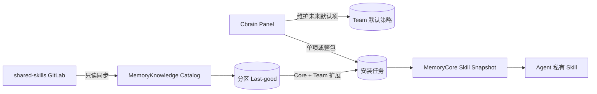

# 公共 Skill 两层目录、Team 默认策略与安装任务

## 1. 目标与边界

Cbrain 从固定 Git 仓库同步公共 Skill，并把目录分为：

- `core/`：通用基础技能，新建 Agent 时全量复制安装。
- `extensions/<pack>/`：业务扩展技能，可单项或整包安装；Team 可配置仅对未来 Agent 生效的默认项。

公共目录是只读发布源，不是运行时资产。安装后仍由 MemoryCore 创建 Agent 私有 Skill 和固定绑定。已有 Agent、已有 Skill、插件、MCP 与 Gateway 工具协议不自动改变。

## 2. 仓库契约

```text
shared-skills/
├── README.md
├── CHANGELOG.md
├── core/
│   ├── README.md
│   └── <skill-name>/SKILL.md
└── extensions/
    ├── README.md
    └── <pack>/
        ├── README.md
        └── <pack-skill-name>/SKILL.md
```

- Skill 目录名必须等于 frontmatter `name`，`description` 必填。
- Skill 名在整个仓库内全局唯一；扩展技能使用领域前缀避免跨包冲突。
- README 是可展示的目录文档，不安装到 Agent。
- Skill 可包含 `agents/`、`scripts/`、`references/`、`assets/`；服务端只存储和复制，不执行脚本。
- 拒绝符号链接、嵌套 Git、Git LFS 指针与路径逃逸；资源限制沿用单文件 5 MB、每 Skill 100 个资源、合计 50 MB。
- 不兼容旧 `skills/` 目录；仓库与服务必须按发布顺序协调升级。

## 3. 架构与数据流



MemoryKnowledge 拥有外部源码快照、目录项、README、Team 默认策略与安装任务。MemoryPanel 负责 Web Session 权限门控和工作进程。MemoryCore 负责安装后的版本、资源、资产登记与 Agent 绑定。

## 4. 同步与故障隔离

同步分区为 `core` 和每个 `extension:<pack>`：

1. Git 提交先落不可变快照。
2. 每个分区独立解析、校验并生成候选目录。
3. 成功分区发布新版本；失败分区保留自己的 last-good。
4. 合并候选目录后执行全局名称唯一检查。冲突涉及的本次成功分区均拒绝发布，避免覆盖任一既有 Skill。
5. 删除扩展包视为显式发布删除，只移出公共目录，不删除 Agent 已安装副本。

目录项保留 `layer`、`pack_key`、`category_path`、`partition_key` 和每项 `source_revision`。同名 Skill 仅移动目录时复用原 `item_id`，确保安装来源身份稳定。

## 5. Team 策略与安装语义

Team 策略保存两类选择：扩展包 `pack` 和单项 `item`。新 Agent 的有效初始化集合为：

```text
全部 Core
+ Team 选择的扩展包中的全部 Skill
+ Team 选择的单个扩展 Skill
→ 按 item_id/name 去重
```

- 策略只影响保存后创建的 Agent，不补装已有 Agent。
- 普通成员可读取策略，只能给自己拥有的 Agent 手动安装。
- Team Admin、Team Owner、System Admin 可维护策略，并可给 Team 内任意 Agent 安装。
- Team 默认模板只排除有效初始化集合中的同名 Skill，不以整个公共目录作为冲突范围。

单项安装保持同步。整包安装和 Agent 初始化统一使用持久化任务：`job_type=manual_pack|agent_init`。每项记录自己的来源版本，成功项不重复执行，失败项最多自动重试三次并可人工仅重试失败项。整包任务的幂等键包含 Agent、包和内容指纹；目录内容变化后会产生新的升级任务。

## 6. 接口

MemoryKnowledge 控制接口：

- 目录：`status`、`list`、`get`、`snapshot`、`documents`、`effective`、`sync`。
- Team 策略：`policy/get`、`policy/set`。
- 安装任务：`bootstrap/create`、`bootstrap/create-pack`、`bootstrap/status`、`bootstrap/retry`、`bootstrap/claim`、`bootstrap/complete`、`bootstrap/cancel`。

MemoryPanel 暴露同源 Web Session 接口，额外执行 Team/Agent 权限检查。安装元数据 `catalog_origin` 保存 source、item、path、revision、content hash 与 job id，用于幂等及升级判断，不赋予权限。

## 7. 迁移、发布与回滚

数据库启动迁移把旧的一 Agent 一任务约束转换为带类型和幂等键的多任务结构，并把旧任务标记为 `agent_init`。目录项新增层级字段，第一次新目录同步会以名称复用旧 ID。

发布顺序：

1. 暂停公共目录自动同步和 Agent 自动初始化。
2. 部署包含新模型与解析器的 MemoryKnowledge/Panel。
3. 发布 `shared-skills` 两层目录提交。
4. 手动同步并核对 Core、各扩展包、README 和分区状态。
5. 恢复新 Agent 自动初始化，创建真实 Agent 验证。

回滚时恢复公共仓库上一提交并回退服务镜像；已安装到 Agent 的 Skill 不删除。

## 8. 验收

- 解析 Core、扩展包、README 和全部资源；拒绝目录/名称错误及跨分区同名。
- 某扩展包损坏时 Core 与其他包升级，损坏包继续使用 last-good。
- 新 Agent 获得六个 Core 和 Team 默认扩展；已有 Agent 不发生变化。
- Team 策略权限、普通成员安装边界和管理员跨 owner Agent 安装正确。
- 单项、整包、部分失败、自动重试、人工重试、重复请求及目录升级均可验证。
- 页面可切换 Core/Extensions、渲染 README/完整 Skill 文件、保存策略并展示安装进度。
- 使用真实 GitLab、MemoryCore 和浏览器完成端到端验证，并在 Codex、Claude Code 中读取安装后的 Skill。
