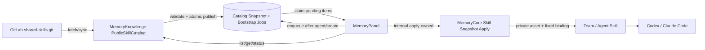
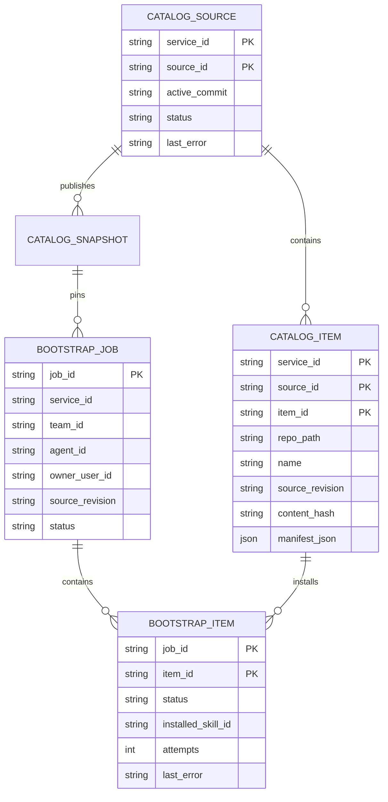
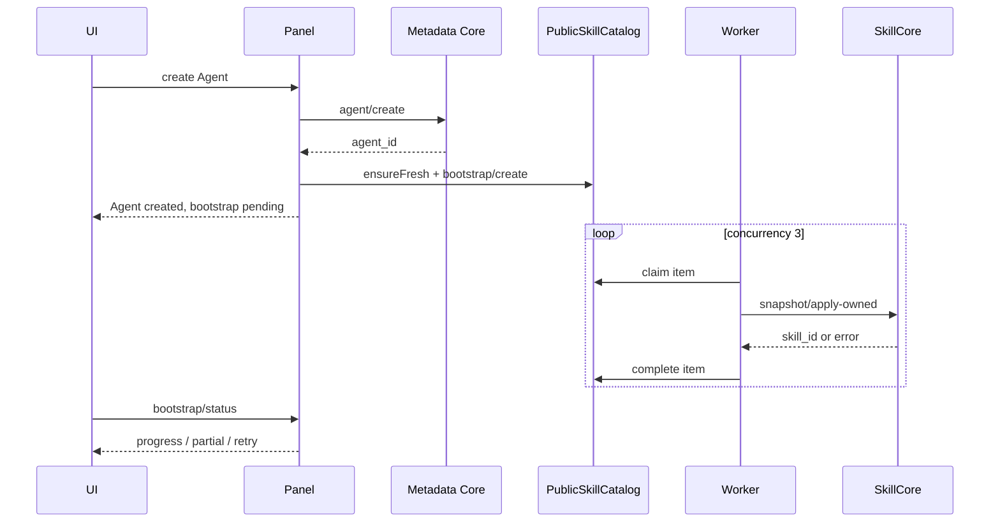

# Architecture Design — 公共 Skill 仓库与新 Agent 自动安装

## 1. Executive Summary

Cbrain 增加实例级、只读的公共 Skill 目录。目录由固定 Git 仓库
`http://10.0.0.5/shared-components/shared-skills.git` 提供，MemoryKnowledge
负责安全同步和 last-good 快照；公共项本身不是运行时资产。新 Agent 创建后，
Panel 创建持久化 bootstrap job，把创建时目录快照中的全部 Skill 幂等安装为该
Agent 的 private fixed Skill。部分失败不回滚 Agent，可重试；已有 Agent 和已安装
Skill 不自动跟随仓库更新。

## 2. Goals and Non-Goals

目标：

- 同一实例所有团队可浏览公共 Skill。
- 新 Agent 自动安装创建时公共目录中的全部 Skill。
- 支持已有 Agent 手动安装、已安装 Skill 手动升级。
- 仓库、进程或单个 Skill 故障不阻断 Agent 创建。
- 保持现有插件、MCP、Skill 权限和运行时加载链路不变。

非目标：

- 不让 Agent 运行时直接读取 Git 仓库。
- 不自动补装现有 Agent，不持续向已有 Agent推送新增 Skill。
- 不自动升级已安装 Skill，不从 Cbrain 写回公共仓库。
- MVP 不支持在页面添加任意公共仓库。

## 3. Confirmed Facts and Assumptions

已确认：

- 现有 Skill 必须归属 team 和 owner Agent，创建后登记为 private asset 并 fixed bind。
- Skill 内容和资源支持不可变版本、乐观锁、单文件 5 MB、单 Skill 50 MB。
- MemoryKnowledge 已具备 Git HTTP(S)、内网 host 白名单、只读 Token 和持久化 SQLite。
- 公共仓库当前存在但没有任何 refs；初始状态应为 `empty`，不是错误。

默认：

- source id=`shared-skills`，branch=`main`，同步周期 300 秒。
- 创建 Agent 时使用 last-good；目录过期时最多等待同步 5 秒。
- bootstrap 并发 3，单项自动重试 3 次，之后进入可人工重试的 partial 状态。

## 4. System Boundary and Data Flow



MemoryKnowledge owns external source and bootstrap state; MemoryCore owns installed Skill;
MemoryPanel owns authenticated UI orchestration. Public catalog items never enter `meta_assets`.

## 5. Repository Contract

```text
shared-skills/
├── README.md
└── skills/
    └── <skill-name>/
        ├── SKILL.md
        ├── scripts/
        ├── references/
        └── assets/
```

- Directory name must equal frontmatter `name`; `description` is required.
- Only regular files are accepted; symlinks, submodules, path traversal and Git LFS pointers fail the commit.
- At most 100 resources, 5 MB each and 50 MB total per Skill.
- One invalid item rejects the complete commit. The previous active snapshot remains readable.
- Scripts are stored and exposed as resources but never executed by the server.

## 6. Components and Interfaces

MemoryKnowledge exposes `/v3/public-skills/{list,get,status,snapshot,sync}` and
`/v3/public-skills/bootstrap/{create,status,retry,claim,complete}`. `sync`, worker-facing
claim and completion endpoints are control-plane operations. A bootstrap job pins one
catalog revision and contains one idempotent item per `(agent_id, source_id, item_id)`.

MemoryPanel exposes authenticated `/api/v1/public-skills/*` routes. All users may list/get;
system_admin alone may sync; installation and retry require that the caller owns the target
Agent in the selected Team. `agent/create` success enqueues a job without blocking the response.

MemoryCore adds `/v3/internal/skill/snapshot/apply-owned`. It validates actual Agent owner/team,
then creates v1 or appends exactly one version with full resource replacement and catalog
provenance metadata. Existing public Skill APIs stay compatible.

## 7. Data Model



Installed Skill `metadata_json.catalog_origin` stores source id, item id, repo path,
revision, content hash and bootstrap job id. This provenance drives installed/update status
but grants no permission.

## 8. Core Sequence and Failure Semantics



- Repo failure with last-good uses last-good; without it creates an empty/failed job.
- Successful items are never repeated. Failed items retry three times and remain visible.
- Name collision with non-catalog Skill returns `SKILL_NAME_CONFLICT`; no overwrite or rename.
- Quota and version conflicts produce partial jobs; Agent remains usable.
- Agent deletion cancels uncompleted jobs. Source deletion never removes installed copies.

## 9. Security, Availability, and Observability

- Git host must pass the existing SSRF allowlist; embedded credentials are forbidden.
- Token is injected only into Git subprocesses and is excluded from DB, metadata and logs.
- `main` is the publication boundary and should be protected by GitLab review rules.
- Snapshot publication is atomic and last-good survives invalid commits and restarts.
- Structured logs and metrics cover source, commit, item id, sync duration, rejection reason,
  bootstrap progress and retries, without logging Skill bodies or credentials.

## 10. Migration, Testing, and ADR

Rollout is disabled-by-default: deploy schema and APIs, configure the fixed repo, validate empty
state, publish a first valid commit, validate manual install, then enable Agent auto-install.
Rollback clears the feature configuration and reverts the image; already installed Skills remain.

Tests cover parser limits, empty/invalid/unchanged repo sync, last-good, snapshot atomicity,
owner/team authorization, idempotent retry, restart recovery, cancellation, conflict/quota errors,
UI states, and real `skill_search/get/file_read` after a new Agent bootstrap.

ADR decisions:

1. Public catalog + copy-on-install instead of cross-team live references.
2. MemoryKnowledge owns Git and jobs; MemoryCore owns installed Skills.
3. Creation-time pinned snapshot; no existing-Agent backfill and no automatic upgrades.
4. Agent creation survives partial bootstrap failure and exposes explicit retry.

Three reviews pass with one accepted scaling risk: if the public catalog becomes too large for
every new Agent, revisit the policy and introduce repository `default: true` selection.
