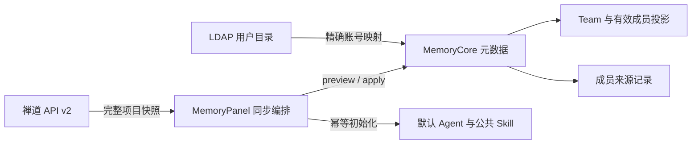
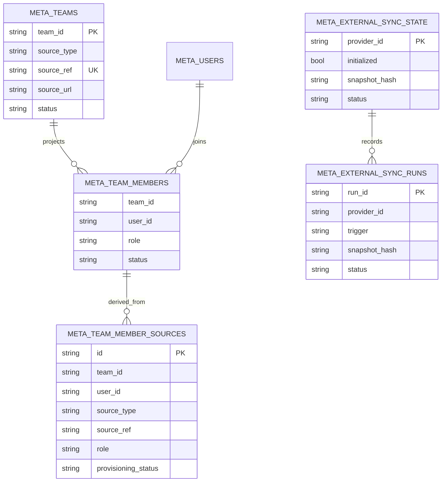
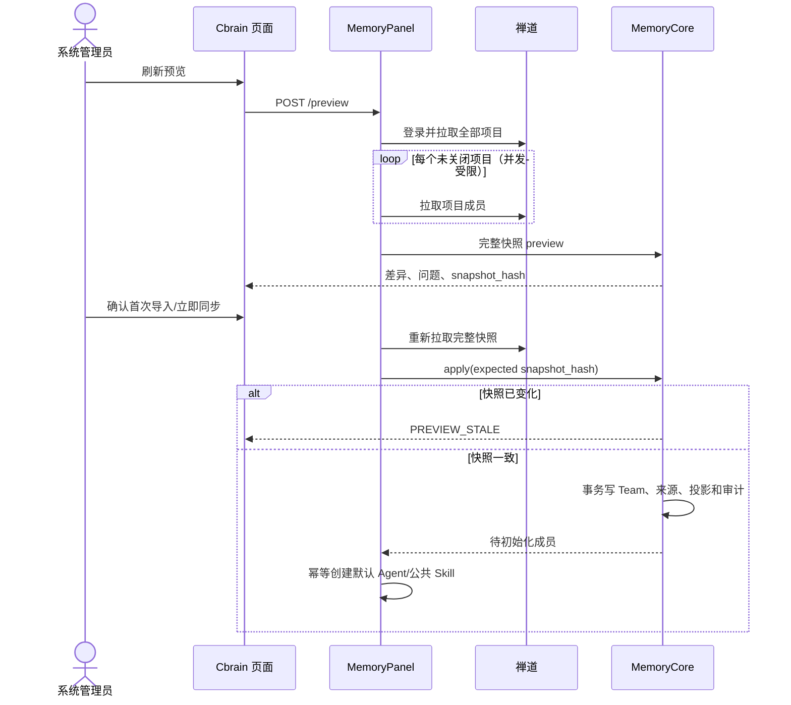

# 禅道项目与成员同步设计

## 目标与边界

Cbrain 单向、只读地将禅道“未关闭项目”映射为 Team，并将项目 PM 与成员映射为 Team 成员。禅道仍是项目基础信息和来源成员的唯一事实源；Cbrain 保留手工 Team、手工成员、Agent、Wiki/RAG、Code Graph、Skill 和 Chat Memory 的管理能力。

不在本期同步：项目集、执行/迭代、产品、任务、Bug、工艺或其他业务对象。同步默认关闭，首次导入必须由系统管理员预览并确认。



## 业务规则

- 每个禅道项目首次出现时新建独立 Team，不按名称关联现有手工 Team。
- 只创建未关闭项目；已同步项目关闭时 Team 归档，重新打开时恢复。
- Team Owner 固定为执行首次导入的系统管理员。
- 禅道 PM 映射为 Team admin，即使 PM 不在项目成员接口结果中也单独加入。
- 其他项目成员映射为 Team member，不使用禅道自由文本角色。
- 账号仅按 `禅道 account == 指定 LDAP provider 下 active 用户 username` 精确匹配；缺失、停用或重复均跳过并进入问题清单。
- 禅道来源与手工来源合并，角色优先级为 `admin > member > reviewer`。删除某个来源不会误删仍有其他来源的有效成员。
- 禅道 Team 的名称、编码、描述、状态由同步维护；活跃 Team 不允许手工删除。
- 禅道来源成员不允许手工移除；禅道 PM 不允许手工降级。管理员仍可增加手工成员或将普通来源成员额外提升为管理员。
- 同步只移除成员授权来源，不删除该用户已有 Agent 和资产。

## 数据模型



`meta_team_members` 是有效权限投影；`meta_team_member_sources` 是可审计的来源事实。存量成员在数据库初始化时回填为 `manual` 来源。

## 同步流程



任何项目分页或成员接口失败，Panel 都不会提交不完整快照。Token 只保存在进程内存中，业务请求遇到一次 401 时重新登录并重试一次。

## 配置与安全

核心配置：

```text
CBRAIN_ZENTAO_SYNC_ENABLED=false
CBRAIN_ZENTAO_PROVIDER_ID=zentao:main
CBRAIN_ZENTAO_BASE_URL=https://zentao.example.com
CBRAIN_ZENTAO_ACCOUNT=admin
CBRAIN_ZENTAO_PASSWORD_FILE=/run/secrets/cbrain-zentao-password
CBRAIN_ZENTAO_IDENTITY_PROVIDER_ID=ldap:example
CBRAIN_ZENTAO_SYNC_INTERVAL_MS=300000
```

密码只能通过只读 secret 文件挂载，不能写入仓库、环境变量、页面或日志。启用后，定时器在首次确认前不执行写入；初始化后每五分钟单飞同步一次。

## ADR

1. 采用“来源事实 + 有效投影”，不以覆盖式成员表实现同步，避免禅道撤员误删手工授权。
2. 不按 Team 名称自动关联，避免同名误绑定和不可逆数据污染。
3. 采用完整快照与稳定哈希，确保预览和应用之间的数据一致性。
4. 关闭项目仅归档 Team，不级联删除 Agent 与知识资产，保留审计与恢复能力。
5. 外部系统访问集中在 Panel，Core 只接收标准化快照，避免业务内核绑定禅道协议。

## 验证策略

- 纯领域测试：身份解析、PM 提升、关闭/重开、成员增删、稳定哈希。
- SQLite/Mongo 存储契约：来源回填、投影合并、事务应用、幂等。
- 客户端测试：登录、分页、受限并发、401 刷新、超时和不完整快照拒绝。
- Panel 路由与权限测试：仅系统管理员可预览和应用。
- 安全集成测试：假禅道 + 真实 SQLite Core；生产禅道只做只读预览，未经明确确认不执行 apply。
